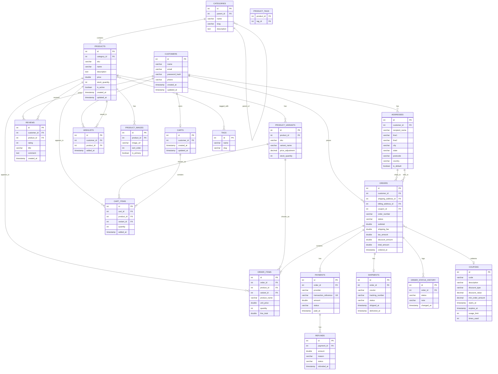

# E-commerce Entity Relationship Diagram (v2)

## Relationship summary

- One customer can have many addresses, orders, reviews, and wishlist entries, and owns at most one active cart.
- One category can contain many products and can optionally have a parent category.
- One product can have many images, variants, tags, and reviews.
- A cart or an order holds one or more line items; each line item can optionally point to a specific product variant.
- Products and orders (and products and carts) form many-to-many relationships through their respective item tables.
- An order references two addresses (shipping and billing), can optionally redeem one coupon, and logs every status change it goes through.
- An order can have multiple payment attempts, zero or one shipment, and each payment can have multiple refunds.
