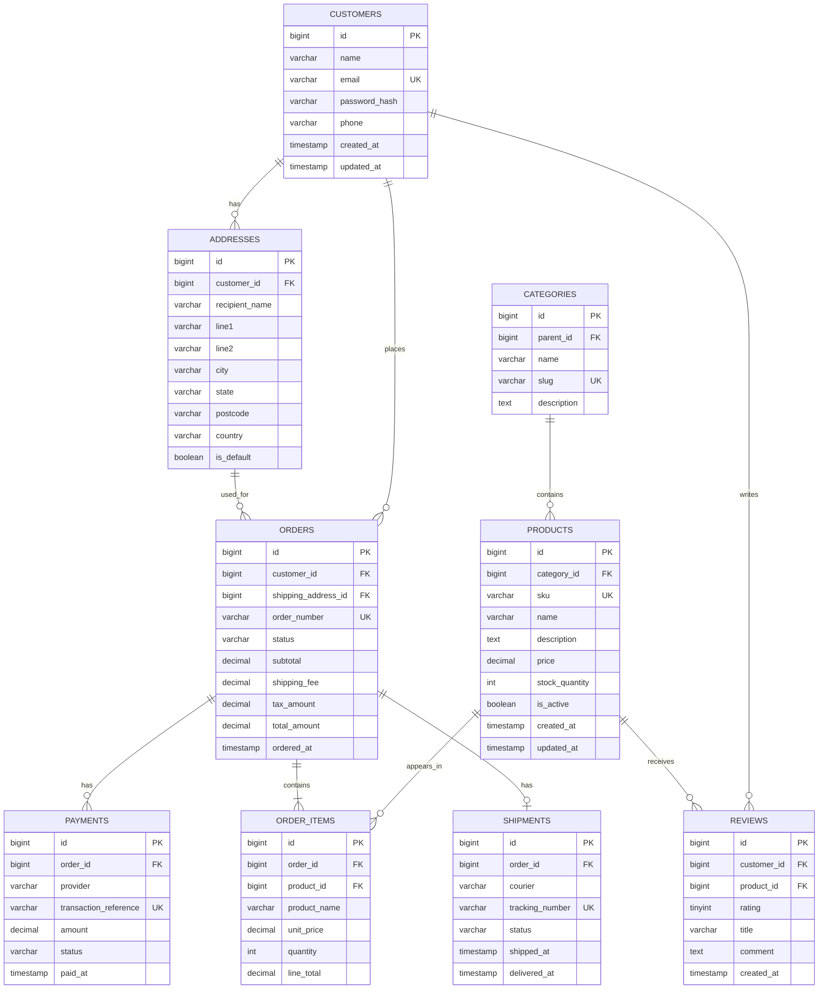

# E-commerce Entity Relationship Diagram

## Relationship summary

- One customer can have many addresses, orders, and reviews.
- One category can contain many products and can optionally have a parent category.
- One order contains one or more order items.
- Products and orders form a many-to-many relationship through `order_items`.
- An order can have multiple payment attempts and zero or one shipment.
